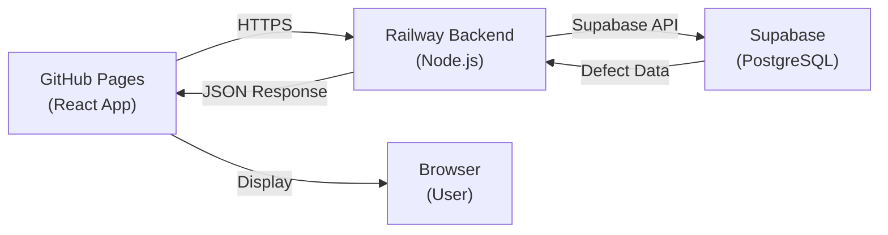

# GitHub Pages Deployment Configuration

This document outlines how the Frontend is deployed to GitHub Pages with Supabase integration.

## Deployment URL
- **GitHub Pages:** https://Carzown.github.io/Glass-Defect-Detection-Prototype/
- **Backend (Railway):** https://glass-defect-detection-prototype-production.up.railway.app
- **WebSocket:** wss://glass-defect-detection-prototype-production.up.railway.app/ws
- **Supabase:** https://kfeztemgrbkfwaicvgnk.supabase.co

## Build Process

The Frontend is automatically built and deployed to GitHub Pages when code is pushed to the `main` branch.

### npm Scripts (Frontend/package.json)
```json
{
  "scripts": {
    "start": "react-scripts start",
    "build": "react-scripts build",
    "predeploy": "npm run build",
    "deploy": "gh-pages -d build"
  }
}
```

### GitHub Actions Workflow
When you push to `main`:
1. GitHub automatically triggers the build process (if configured)
2. `npm run build` compiles React code with production environment variables
3. The `build/` directory is deployed to GitHub Pages

## Environment Variables

### Development (.env.local)
```env
REACT_APP_SUPABASE_URL=https://kfeztemgrbkfwaicvgnk.supabase.co
REACT_APP_SUPABASE_ANON_KEY=eyJ...
REACT_APP_BACKEND_URL=http://localhost:5000
REACT_APP_WS_URL=ws://localhost:5000/ws
REACT_APP_ENABLE_SUPABASE_REALTIME=true
```

### Production (.env.production)
```env
REACT_APP_SUPABASE_URL=https://kfeztemgrbkfwaicvgnk.supabase.co
REACT_APP_SUPABASE_ANON_KEY=eyJ...
REACT_APP_BACKEND_URL=https://glass-defect-detection-prototype-production.up.railway.app
REACT_APP_WS_URL=wss://glass-defect-detection-prototype-production.up.railway.app/ws
REACT_APP_ENABLE_SUPABASE_REALTIME=true
```

## How GitHub Pages Receives Supabase Data



## Defect Data Flow

1. **React Component Mounts** → `Frontend/src/pages/Dashboard.js`
2. **Fetch Supabase Data** → `Frontend/src/services/defects.js`
3. **HTTP Request** → `https://glass-defect-detection-prototype-production.up.railway.app/defects`
4. **Backend Query** → `Backend/defects.js` queries Supabase
5. **Supabase Response** → Returns defect records from `defects` table
6. **Data to Dashboard** → Display in list, modal, status updates

## Polling Configuration

The Dashboard polls Supabase every **3 seconds** via the Railway backend:
```javascript
const pollInterval = setInterval(() => {
  loadSupabaseDefects(now);
}, 3000);
```

This ensures defects are updated in real-time on GitHub Pages.

## WebSocket Connection

For real-time video frames from Raspberry Pi:
- **Secure URL:** `wss://glass-defect-detection-prototype-production.up.railway.app/ws`
- **Protocol:** WebRTC + custom signaling
- **Auto-reconnect:** Every 3 seconds if disconnected

## CORS Configuration

The Railway backend must allow requests from GitHub Pages:
```javascript
// In Backend/server.js
const corsOptions = {
  origin: [
    'https://Carzown.github.io',
    'http://localhost:3000',
    'http://localhost:5000'
  ],
  credentials: true
};
```

## Testing the Deployment

1. **Browser Console Logs**
   - Look for `✅ Supabase initialized successfully`
   - Check for `[Dashboard] Fetching defects from Supabase...`
   - Verify successful fetch: `[fetchDefects] ✅ Successfully fetched X defects`

2. **Network Tab**
   - Check requests to `glass-defect-detection-prototype-production.up.railway.app`
   - Status should be `200` for successful responses
   - Payload should contain defect records

3. **Application Tab**
   - Check Environment Variables in DevTools
   - Verify `REACT_APP_BACKEND_URL` points to Railway
   - Verify `REACT_APP_SUPABASE_*` are set

## Troubleshooting Production Issues

### "Cannot connect to backend"
- Verify Railway backend is running
- Check network tab for actual error
- Verify CORS headers are set

### "Table does not exist"
- Create `defects` table in Supabase
- Verify table schema matches expected columns

### "No defects appearing"
- Check Supabase dashboard for data
- Verify Supabase credentials in Railway environment variables
- Check backend logs on Railway

## Deployment Steps

### To Deploy Changes to GitHub Pages:

1. **Commit changes locally**
   ```bash
   git add .
   git commit -m "Description of changes"
   ```

2. **Push to main branch**
   ```bash
   git push origin main
   ```

3. **Verify build (if using GitHub Actions)**
   - Go to GitHub → Actions tab
   - Wait for workflow to complete
   - Check build logs for errors

4. **Verify on GitHub Pages**
   - Navigate to https://Carzown.github.io/Glass-Defect-Detection-Prototype/
   - Open DevTools Console
   - Look for success messages

### Manual Deployment (if needed):

```bash
cd Frontend
npm install
npm run build
npm run deploy
```

This will:
1. Build the React app with production environment variables
2. Deploy the `build/` directory to the `gh-pages` branch
3. GitHub Pages will serve the updated site within seconds

## Environment Variables on Railway

The Backend running on Railway requires these environment variables:

```
SUPABASE_URL=https://kfeztemgrbkfwaicvgnk.supabase.co
SUPABASE_SERVICE_ROLE_KEY=eyJ... (from Supabase Settings → API)
SUPABASE_KEY=eyJ... (anon key)
FRONTEND_URL=https://Carzown.github.io/Glass-Defect-Detection-Prototype
NODE_ENV=production
PORT=5000
```

Set these in Railway Dashboard → Variables tab.

## Summary

✅ GitHub Pages (Frontend) → Requests from Railway Backend
✅ Railway Backend → Fetches from Supabase
✅ Supabase → Stores and returns defect data
✅ Real-time polling → Updates Dashboard every 3 seconds
✅ WebSocket → Real-time video streaming from Raspberry Pi

The system is fully integrated and ready to display Supabase defect data on GitHub Pages.
